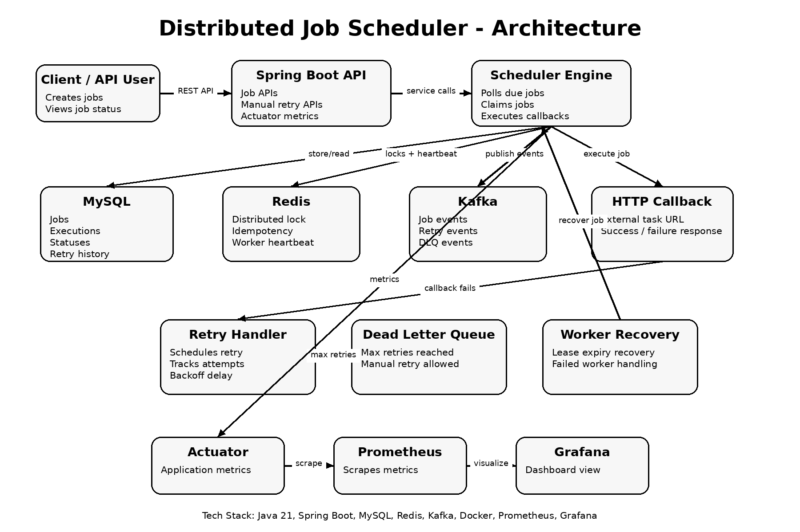

# Distributed Job Scheduler

## About The Project

This project is a backend system that automatically executes tasks at scheduled times.

The idea behind this project is similar to how real-world systems send emails, generate reports, process payments, or trigger notifications in the background without human intervention.

Instead of executing tasks directly, the scheduler triggers HTTP callbacks, allowing it to work with any external application or service.

The main focus of this project is reliability. If a task fails, the system automatically retries it. If it continues to fail, it is moved to a Dead Letter Queue (DLQ) for investigation or manual retry.

The project also includes distributed system concepts such as worker heartbeats, lease recovery, distributed locking, and multi-worker coordination.

---

## What This Project Can Do

* Create and store scheduled jobs
* Execute jobs automatically
* Trigger external APIs using HTTP callbacks
* Retry failed jobs automatically
* Move permanently failed jobs to a Dead Letter Queue
* Manually retry failed jobs
* Recover jobs abandoned by crashed workers
* Detect inactive workers
* Prevent duplicate execution in a multi-worker environment
* Run inside Docker containers

---

## Why I Built This

Most beginner backend projects focus on CRUD operations and authentication.

I wanted to build something that explores how real backend infrastructure works behind the scenes.

This project helped me learn:

* Distributed systems concepts
* Background job processing
* Fault tolerance
* Retry strategies
* Worker coordination
* Docker deployment
* Database-driven scheduling

---

## Technologies Used

* Java 21
* Spring Boot
* Spring Data JPA
* MySQL
* Docker
* Docker Compose
* Redis integration
* Kafka integration
* Metrics and monitoring
* Prometheus
* Grafana dashboards

---

## How It Works

1. A job is created and stored in the database.
2. The scheduler continuously checks for jobs that are ready to run.
3. A worker picks up the job and executes its callback URL.
4. If the execution succeeds, it is marked as successful.
5. If it fails, the scheduler retries it automatically.
6. After the maximum number of retries, the job is moved to the Dead Letter Queue.
7. Failed jobs can be manually retried from the DLQ.

---

## Distributed Features

This project includes several distributed systems concepts:

* Worker registration and heartbeats
* Dead worker detection
* Lease expiry recovery
* Distributed locking
* Atomic job claiming
* Multi-worker execution safety

I validated the system by running multiple scheduler instances connected to the same database and confirmed that only one worker executes a job at a time.

---

## Running The Project

Build the application:

```bash
mvn clean package
```

Start the application using Docker:

```bash
docker compose up --build
```

Stop the application:

```bash
docker compose down
```

## Architecture



---
## Known Limitations

This project was built primarily to learn distributed systems and scheduling concepts.
The following production-grade features are intentionally left for future versions:
*Authentication & Authorization
*Role-Based Access Control (RBAC)
*Rate Limiting
*API Gateway Integration
*SSRF Protection for callback URLs
*Advanced Input Validation
*Payload Size Limits
*Distributed Tracing
*HTTPS/TLS Configuration
*Secret Management
*CI/CD Pipelines
*Comprehensive Automated Testing
These improvements are planned as future enhancements and can be tracked through GitHub Issues.

## Author

Aryendra Singh

Computer Science Student | Backend Developer | Distributed Systems Enthusiast
